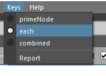
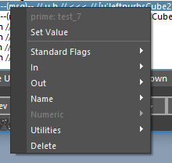
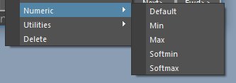
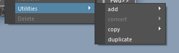
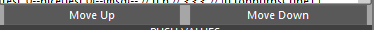

.. toctree::

********************
Attr Tools
********************

Status: Alpha release - Spring 2017

Last Updated: 09.12.2017

Overview
==========
cgmAttrTools are a collection of tools for making working with attributes in maya a little less opaque.

.. note::
    Still refining value pushing copying workflow

**What can I do with it?**

* Easy attribute adding, setting and editing
* Succinct, sortable display of node attributes and data about them
* Value pushing - current data, next/previous frame, forward/back on timeline and all.
* Multi setting and more

Accessing
==============

#. UI - Top cgm menu - ``CGM > TD > Attributes > cgmAttrTools``
#. Toolbox - ``TD Tab> Rigging > AttrRow > cgmAttrTools``
#. MarkingMenu - ``TD Mode > Utils (NW) > Attr (SW) > attrTools 2.0 (SW)``
#. Python
    
.. code-block:: guess

    import cgm.core.tools.attrTools as ATTRTOOLS
    ATTRTOOLS.ui()
 
If you open the ui, you should see something like this:

.. image:: _static/img/attrtools/attrtools_base.png
    :align: center

The UI has two main parts. The top menu and body.

Menu
========
The top menu is where we set our options.

Context
----------
Introduced this concept with our 2.0 rewrite and the marking menu. In short, it is an easy way to work on numerous items at once in a clear manner. Not every function in the ui is contextual.

.. image:: _static/img/attrtools/attrtools_menu_context.png
    :align: center

* ``loaded`` - Any objects loaded in the tool will be acted on
* ``selection`` - Only act on selected nodes. Attributes in context will be those selected in ui, then any selected in channel box will be extended to that list.
* ``children`` - may go away, testing for attrTools
* ``hierarchy`` - may go away, testing for attrTools
* ``scene`` - may go away, testing for attrTools
* ``report`` - Report current context data without making any value or time changes

Values
--------
For value pushing. What values will be pushed in selection and key context

.. image:: _static/img/attrtools/attrtools_menu_values.png
    :align: center

* ``primeAttr`` - The current values of the first attribute in your ui selection will be pushed
* ``primeAttrPer`` - For each key, the primeAttr's value at that time will be pushed to the others
* ``primeNode`` - The current values of all selected attributes in the ui will be pushed
* ``primeNodePer`` - For each key, primeNode's selected attrs will be pushed to other nodes
* ``each`` - Each contextual object's current values will be pushed
* ``report`` - Report current value data without making any value or time changes

Keys
-------
For value pushing as well. Specify how key data is understood and combined by the tool.

    
* ``primeNode`` - The keys of the primeNode will be used
* ``each`` - Each object's keys will be used for their respective value pushes
* ``combined`` - The keys of all contextual nodes are combined and each object will be value pushed on each of those keys
* ``report`` - Report current key data without making any value or time changes

Body
========

.. image:: _static/img/attrtools/attrtools_base.png
    :align: center
    

Objects
----------
At the top of the body is a mel label which will update to let us know information about what we're working with. This is where you load objects which will be used to load our attribute data.

* ``Load selected`` - Loads selected objects to the ui. First object is the 'prime' object.
* ``Report`` - May get rid of, just playing with if necessity
* ``Clear`` - Clear selected objects

When you load mulple objects...

.. image:: _static/img/attrtools/attrtools_objects_multi.png
    :align: center
    
The prime node is the first in the selection and represented by the ``<nurbsSphere1>``.

**Sort Row**

* ``Sort`` - Sorts loaded attributes alphabetically
* ``Shared`` - if more than one object is loaded, ONLY loads attributes shared by loaded objects.
* ``Default``- Designed to quickly get the most useful attributes
* ``On`` - Only loads 'normal' attributes which are keyable and or user defined
* ``Off`` - every settable attribute loads
* ``User`` - load user defined attributes or not
* ``Others`` - Every attribute on the object

Attribute List
---------------
This may seem overwhelming at first but it's not too bad once we break it down. Each line is an attribute. You can select more than one attribute at once.

* Double clicking a row will bring up an uiPrompt to set the value.
* With message attributes any objects selected will be stored if you double click a message attrtribute. If more than one item is selected, the attribute will be converted to multimessage if it is single.

Here's a loaded list:

.. image:: _static/img/attrtools/attrtools_loaded.png
    :align: center

To get a better idea of what we're looking at let's look at a couple examples:

Example 1:

.. image:: _static/img/attrtools/attrtools_attrrow_ex1.png
    :align: center
    
* ``settings`` - Attribute long name
* ``enum`` - Attr type
* ``u`` - User defined
* ``v`` - Visible in channel box
* ``k`` - Keyable
* ``[off],on`` - With an enum, options displayed with the current option wrapped in ``[]``.

Example 2:

.. image:: _static/img/attrtools/attrtools_attrrow_ex2.png
    :align: center
    
* ``rotateX`` - The attribute long name
* ``alias(hi)`` - This attribute it aliased with a name of ``hi``
* ``da`` - doubleAngle attr type
* ``v`` - Visible in channel box
* ``k`` - Keyable
* ``<anim`` - Animation curve input (it's keyed)
* ``>>>`` - Outbound connection on this attribute
* ``19.679...`` - Current Value

Popup menu
----------------------
Right clicking any of the attribute rows will bring up a pop up menu...

    
Most of these functions are multiset. Meaning any selected attributes on loaded objects will be modified. .

.. note::
    You must reselect the attributes if you make selection changes and in selection context so the menu can rebuild. It rebuilds on ui selection.

Set Value
^^^^^^^^^^^
* A promptDialog is offered to provide a value.
* Providing an empty dialog with ``ok`` will clear said value in general. For example, clearing the defaultValue from the dialog in the promptDialog will clear the defaultValue on the selected attribute(s)
* If you a message attribute is selected, selected objects will be stored.
* enums may be set by index or string
* list values are accepted via comma split for vector type attributes
* bool accepts ``1/0`` , ``t/f`` , ``true/false`` , ``y/n`` , ``yes/no``
    
.. image:: _static/img/attrtools/attrtools_pop_standard.png
    :align: center
    
Standard Flags
^^^^^^^^^^^^^^^
* ``Lock and Hide`` - both at once
* ``Unlock and Show`` - both at once
* ``Keyable/Locked/Hidden`` - Bool options to change values
    
Connections
^^^^^^^^^^^^^
This one is a lot packed into a single section. Let's dig in.

**In**

.. image:: _static/img/attrtools/attrtools_pop_connections.png
    :align: center

* ``obj.attr`` - If connected, name of driver
* ``Select`` - Select the connection
* ``Load`` - Load the driver to the ui
* ``Break`` - Break connection
* ``From All`` - Only enabled with multiple selected objects. If enabled, connects all the prime attributes from the specified object back to our prime.
* ``From Channelbox`` - Only enabled if there are channelbox selected attributes AND the len of channelbox attrs match that of the prime attrs. Uses the channelbox attrs to drive from our specified object
* List of attributes of our driven

    * List of objects we can connect in
    
        * List of attributes to connect in

**Out**

.. image:: _static/img/attrtools/attrtools_pop_connections_out.png
    :align: center

* List of driven attributes

    * ``Select`` - Select the connection
    * ``Load`` - Load the driver to the ui
    * ``Break`` - Break connection
    
* ``To All`` - Only enabled with multiple selected objects. If enabled, connects all the prime attributes from prime to selected objects or all others
* ``To Channelbox`` - Only enabled if there are channelbox selected attributes AND the len of channelbox attrs match that of the prime attrs. Uses the channelbox attrs to drive from our specified object

Name
^^^^^^

.. image:: _static/img/attrtools/attrtools_pop_name.png
    :align: center
    
* ``Rename`` - Only userDefined attribute may be renamed
* ``Nice`` - Set the nice name of an attribute
* ``Alias`` - Set an alias of an attribute

Numeric
^^^^^^^^
Set and clear values via promptDialog.

* ``Default``
* ``Min``
* ``Max``
* ``softMin``
* ``softMax`` 

Utilities
^^^^^^^^^^

    
* ``Add`` - add a new attribute from a selection of types. A promptDialog is provided to name it.
* ``Convert`` - Convert a userDefined attr to another type
* ``Copy`` - Copy the selected attributes in context to other targets. A promptDialoge is provided to get a name

    * ``To`` - Copy from the primeNode to other targets
    * ``ConnectBack`` - Copy and connect back to the primeNode. Driving the primeNode
    * ``ConnectTo`` - Copy and connect to the other nodes. Driving the new attributes.
    
* ``Duplicate`` - Duplicate an existing attribute on the loaded objects. A promptDialog is provided to name it.
* ``Delete`` - Only userDefined attributes may be deleted.

Move Row
---------------

Move buttons only show up when user defined attributes are visible. The let you move attributes in the channel box that are visible.

* ``Move Up`` - Move selected attributes up in the channel box
* ``Move Down`` - ...down...

Push Values
---------------
Values are pushed on nodes by their context, values and key options in the menu at the top of the ui.

.. image:: _static/img/attrtools/attrtools_pushrow.png
    :align: center

* ``Current`` - Push the current values to contextual nodes. If only one node is loaded if you're not in primeAttr or primeAttr per node, it's not gonna do anything.
* ``<<Back`` -Push to all previous keys from the current time
* ``<Prev`` - Push to the first previous key from the current time
* ``All`` - Push to all contextual keys
* ``Next>`` - Push to the next key from the current time
* ``Fwd>>`` - Push to all keys after the current time