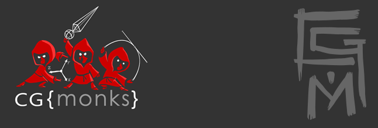

.. cgmTools documentation master file, created by
   sphinx-quickstart on Wed Aug  2 15:17:01 2017.
   You can adapt this file completely to your liking, but it should at least
   contain the root `toctree` directive.

Welcome to cgmToolbox User Guide!
====================================

The cgmToolbox is a collection of tools we write, share, and use to do our work. Because we don't charge for the 
toolbox, others allow us to share their work as well.

Connect
=============
* `CG Monks <http://www.cgmonks.com/>`_
* `Facebook <https://www.facebook.com/cgMonks/>`_
* `Bitbucket <https://bitbucket.org/jjburton/cgmtools/downloads/?tab=branches/>`_
* `Vimeo <https://vimeo.com/cgmonks/videos/>`_

Contributors
==============

**cgmTools**

* David Bokser
* Josh Burton
* Ryan Comingdeer

**Additional Contributors**

* Justin Barrett
* Michael Comet
* John Doublestein
* Scott Englert
* Morgan Loomis
* Hamish McKenzie
* Brendan Ross
* Bohdon Sayre

Directory of docs
==================
.. toctree::
   :maxdepth: 5
   
   quickstart
   toolbox
   dynparenttool
   locinator
   settools
   knowledge
   support

Indices and tables
==================
* :ref:`genindex`
* :ref:`modindex`
* :ref:`search`
